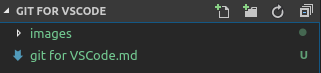

# Preliminary Introducton:
## The Command Pallete:
This is a small window in VSCode which allows you to enter commands for the editor.

To access it, use the following keyboard shortcuts:
<kbd>Ctrl</kbd>/<kbd>⌘</kbd> + <kbd>Shift</kbd> + <kbd>P</kbd>
# Intro to Git:
- Git is a Version Control manager

## Initial Setup:
### Git Config:
- You'll need to use GitBash (Windows) or bash
- The main things to modify are:
    - `user.name` (Your GitHub username)
    - `user.email` (The email address associated with your GitHub account)
    - To set these, use `git config --global user.name YOUR_USERNAME_HERE`/`git config --global user.email YOUR_EMAIL_HERE>`
- An additional modifier if you wish, is to set a default editor. In my case, I have mine set to use VSCode
    - To do this, set `git config --global core.editor` to `"code --wait"`

# Introduction to Git from VSCode
VSCode has a dedicated `Source Control` tab under the `Search` tab.

Under here, you'll be able to keep up with your repositories.

## Forking Repositories:
This section isn't done in VSCode, but on GitHub itself
- To make changes to public repositories, you need to *fork*  the main repository.
- To do this, head over to the main repo and click the Fork button on the top right of the page, under your profile picture

- From here, fork it to your account, and you'll be taken to the repository on your fork.

## Cloning Repositories:
- Open the command pallete and type in `clone`

- Find the URL of the repository you want to clone and paste it into the box that appears (In this case, we'll want to clone your fork)

- A new window should appear asking you where you'd like to clone it to
- Select the folder you'd like to clone to and it will handle the rest

## Adding Remotes:
Remotes are basically references to other repositories. At the moment, VSCode only knows about *your* repository. We need to make it aware of the main repository too.
- Open the Command Pallete and type in `Remote`

- Enter in the name `upstream` (This is a common name for main repositories we want to have code end up in)

- Now enter in the URL for this repository. For the assignments, this will be `https://github.com/JafethvE/UnitTestingAssignments.git`

## Fetching Repositories:
- *Fetch*ing repositories will update VSCode's (and git's) knowledge of what's on all the repositories (for example, new branches, changes, etc.)
- To do this, simply open the Command Pallet and type in `Fetch`
- Click the option that says `Git: Fetch`

(If you know there are changes on the upstream branch but don't see them in VSCode waiting to be pulled, try fetching)

## Initializing new Repositories and creating your first commit:
- Set up a folder for your project, this will be where you hold all your code
- Now, open VSCode and open this folder with it (File > Open Folder... > Navigate to your folder, and select it)
- Open the command pallete and type `init` in the box that appears. You should see an option:
    > Git: Initialize Repository

- Select it, and you'll be prompted to either use the current directory, or select the folder. We'll use the current directory, since it's our project folder

- If you have the Explorer tab open in VSCode, you'll notice any files in there should now be green and have a `U` to the right of them, indicating they're `Untracked`

- To link this up to GitHub, simply [open GitHub](https://github.com), sign in, or create an account if you don't have one, and create a new repository
- We'll want to grab the link to the repository, this is typically `https://github.com/YOUR_GITHUB_NAME/REPOSITORY_NAME.git`
- Head back to VSCode, and open the Command Pallete again. This time, type `remote`, and select the option titled `Git: Add Remote`
- Add a name to the repository, since this is not a fork, we can call this `upstream`
- Now, add the link to your repository in after confirming the name
- Congrats, you have now set up a git repository using VSCode
- If you don't have any files in the project folder, let's just add an empty file for the sake of demonstration
- You'll see it appear in VSCode's Explorer tab too, as mentioned before, it'll be green.
- Head over to the tab below the search (Looks like a fork)
- Under this tab, you'll see the repository name, a box with the prompt `Message`, and a header named `changes`
- Hover over the file(s) you'd like to stage and click the `+` icon beside them. Doing so will stage the changes to commit
- You can also click the `+` icon on the `changes` header to stage all of them.

- You'll now see a new header, `staged changes`. From here, let's add a message for our commit, let's call it `Initial Commit`

- Simply type that into the message box, then click the checkmark above the box to commit your changes

- Finally, we need to push our changes. If you look in the bottom left corner of VSCode, you should see a little refresh-like icon with  some arrows pointing up and down.
    - If there's a number beside the up arrow, that means you have commits to push
    - If there's a number beside the down arrow, that means you have commits to pull
    - Clicking this will both push and pull all changes

- Click that refresh button
- Your commit should now appear on your GitHub repository

## Managing Branches:
- Simply open the command pallete and type in `branch`

- You can use the following options to manage branches.
### Create Branch From...:
- Allows you to create a new branch based off a specified existing branch

### Create Branch...:
- Allows you to create a new branch based off the current branch

### Delete Branch...:
- Allows you to delete a branch

### Merge Branch...:
- Allows you to merge a branch into the current branch

### Publish Branch...:
- Pushes the branch to your remote
- Clicking the refresh icon (will be an upload icon) on the bottom left of your VSCode window will also do this action

### Rename Branch...:
- Allows you to rename your branch
- NOTE: Doing this isn't always recommended

## Recommended Plugins:
### GitLens
- Allows you to view branch history and commit names right within your editor area
### Github Pull Requests
- Allows you to checkout/view pull requests for repositories from within VSCode
