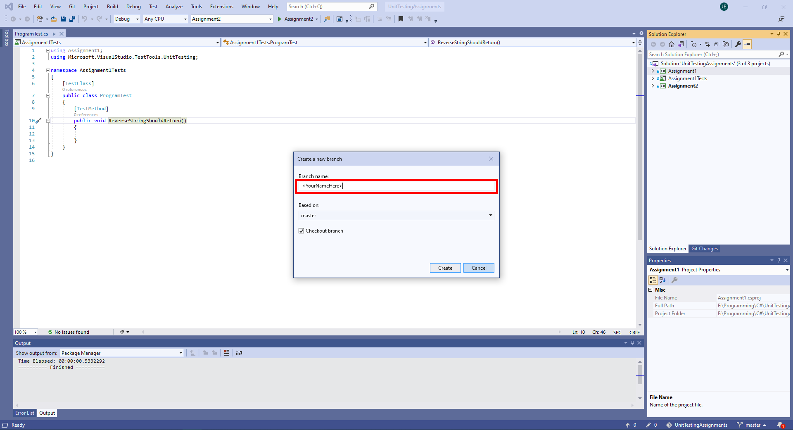
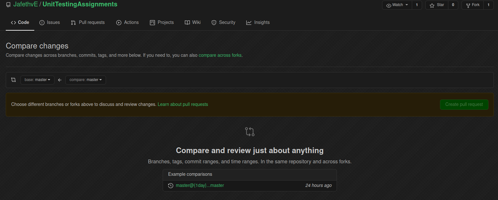
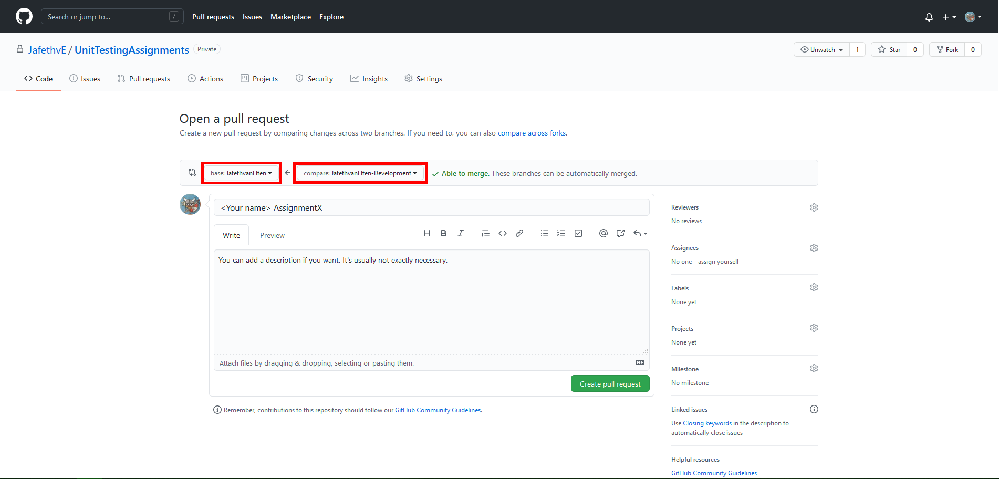
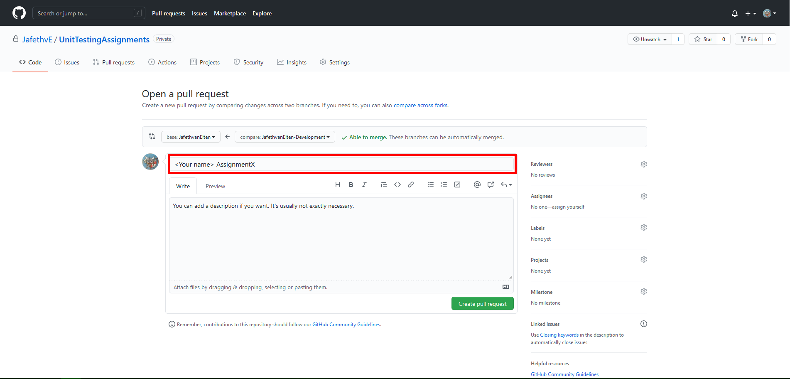
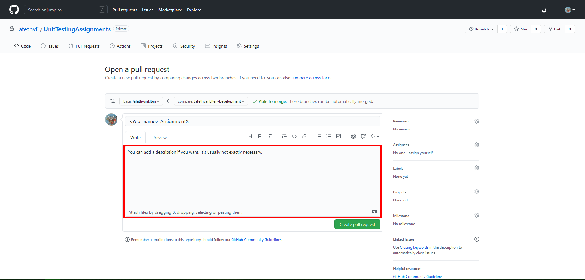

# How to use Git in Visual Studio

To do the assignments, you'll have to check out the repository on your machine, make a branch from the master branch, from there make a development branch to do the actual work on, and then you can hand your work in by means of a pull-request back to your main branch.

## Checking out the repository

By checking out the repository, you're making a local copy of the project on your machine. You can then change this with no risk to the master version that's on github.

1. Go to the github page for the assignments repository: [https://github.com/JafethvE/UnitTestingAssignments](https://github.com/JafethvE/UnitTestingAssignments)
2. On the github page, click the "Fork" button on the top right of the screen.

3. On the github page for your fork click the green "Code" button

4. Copy the checkout link

5. Open Visual Studio
6. Click the Clone a repository button

7. Paste the copied link into the "Repository location" field.

8. Change the "Path" field to wherever you want the source code to be on your local machine.

9. Click "Clone" button

10. Wait for the cloning process to complete.

Now you have cloned the project.

## Creating your branches

Branches are used to split up work for different tasks, or different people.
You will be creating a personal branch for yourself, and then you'll create a development branch from that branch to actually make changes to.

**While making this assignment, don't touch the "master" branch, the branch with just your name, or any branches from other people.**

1. In Visual Studio, open the git menu with the button on the bottom right

2. In the git menu, click the "New Branch..." button

3. Fill your name in as the branchname, either in CamelCase, or Firstname-Lastname. **Don't use spaces.**

4. Click the "Create" button

5. Open the Git menu again.

6. Create another branch

7.Name this branch the same as the branch you just created, and append "-development"

8. Click the "Create" button

9. Open the "Branches" screen with the button on the bottom right.

10. Under UnitTestingAssignments, right-click both branch you have created, and click "Push branch". **Do this for both branches.**

By pushing the branches, you have made a copy of your branches on the github repository.
Now you can start developing.

## Committing and pushing your branches

When you have made some changes, and want to save these, you first commit them to your local branch.
Then you push them to the branch on github, also known as the "remote."

1. Open the "Git Changes" tab, by clicking the button on the right of the project screen.

2. The tab will show you all changes you have made. Changed files, added files, and deleted files.
3. In the Commit Message field, explain, briefly, what you have changed, e.g. "Created unit test for Class X."

4. Click the litte downward arrow next to "Commit All"

5. Click "Commit All and Push"

You have now saved your changes to the remote.

## Handing your assignment in with a pull-request

When you think you are done with your assignments, you can hand them in by making a pull-request for me to review.
This way I can give you easy feedback

1. Go to the github page for the assignments repository: [https://github.com/JafethvE/UnitTestingAssignments](https://github.com/JafethvE/UnitTestingAssignments)
2. From here there are two ways to make a pull request:
3. If you have pushed less than 2 hours ago, it'll show you the option to create a pull-request from your fork.

    1. If the above button is not there, click the Pull-Requests tab.
    
    2. Click "compare across forks"
    
    3. Set the base repository to mine, with the branch 'master' and the head repository to your fork, with your development branch.
    
    4. Click the "Create pull request"-button
3. On the pull-request form, change the base for the pull-request to the branch with your name, and make sure compare is your development branch on your fork.

4. Name the pull request <Your name> Assignments.

5. You can add a description, if you want. This is not required.

6. Click the "Create pull request" button.

You have now made a pull-request with all the changes you have made, which I can then review.

I will either approve or request changes to your pull-request, and give commentary as to why.
If I request changes, you can just make these changes on your machine, and them commit and push them as shown above.
The pull-request will automatically be updated, and I can review it again.

**Don't be disheartened if I request changes several times. This is completely normal.**
In my day job I have had to improve pull-requests dozens of times, and it's always been a learning experience.