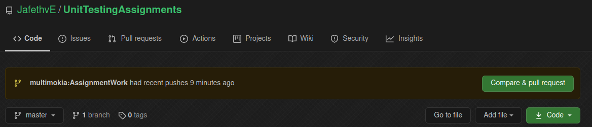
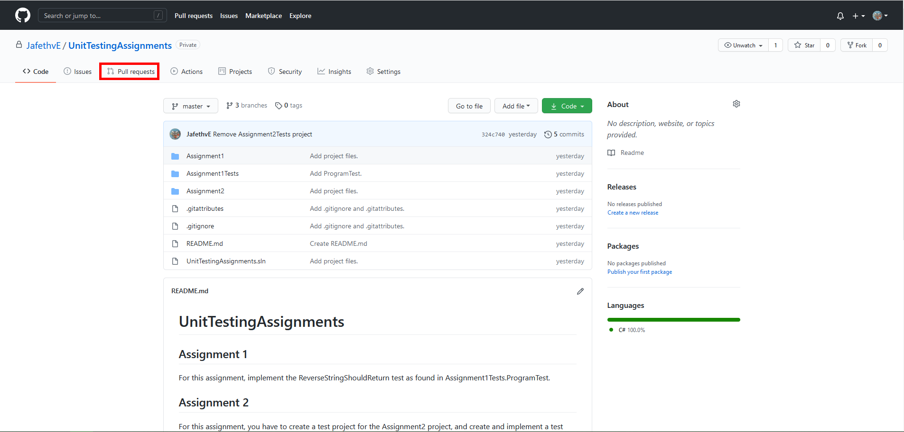
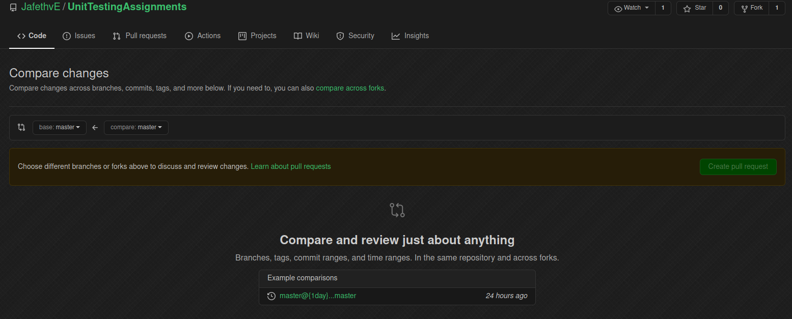
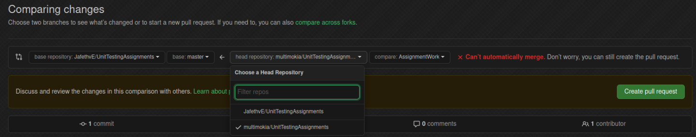
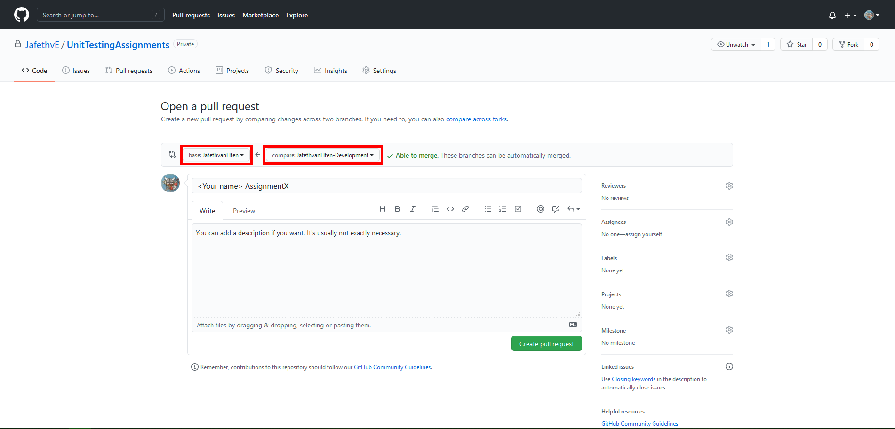
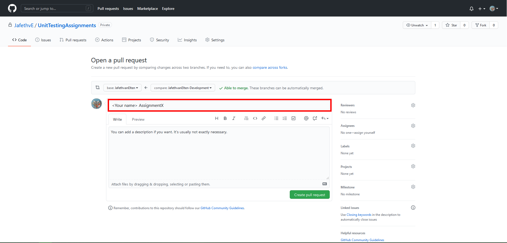
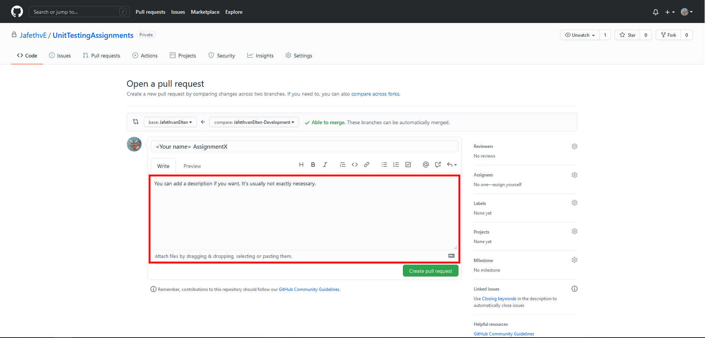
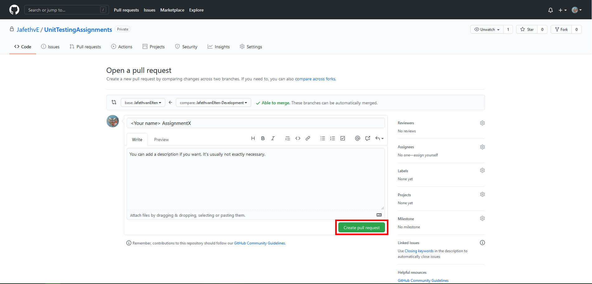
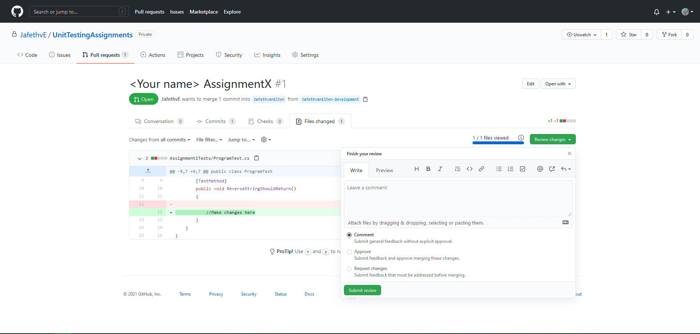

# UnitTestingAssignments

## Assignment 1

For this assignment, implement the ReverseStringShouldReturn test as found in Assignment1Tests.ProgramTest.

## Assignment 2

For this assignment, you have to create a test project for the Assignment2 project, and create and implement a test class for the StringReverser test.
The test project should be named "Assignment2Test"

## Assignment 3

For this assignment, you have to design and create a programme, from scratch with accompanying testing suite, which does the following:

1. The programme asks the user for a list of numbers from the user. The lenght of this list is arbitrary. **How you solve this is up to you.**
2. The programme asks the user for an operation. For this assignment, at least addition, multiplication, and average have to be implemented.
3. The programme performs the entered operation on the numbers the user has given, and gives the result back.

Other requirements:

- **Do not assume that user inputs are valid. Validation and error reporting are part of the assignment**
- Think about class responsibilities.
- Keep test coverage in mind.

Hand this in as two projects, added to the solution. The main project should be named "Assignment3" and the test project should be named "Assignment3Test".

## Handing your assignment in with a pull-request

When you think you are done with your assignments, you can hand them in by making a pull-request for me to review.
This way I can give you easy feedback

1. Go to the github page for the assignments repository: [https://github.com/JafethvE/UnitTestingAssignments](https://github.com/JafethvE/UnitTestingAssignments)
2. From here there are two ways to make a pull request:
3. If you have pushed less than 2 hours ago, it'll show you the option to create a pull-request from your fork.
   
    1. If the above button is not there, click the Pull-Requests tab.
       
    2. Click "compare across forks"
       
    3. Set the base repository to mine, with the branch 'master' and the head repository to your fork, with your development branch.
       
    4. Click the "Create pull request"-button
3. On the pull-request form, change the base for the pull-request to the branch with your name, and make sure compare is your development branch on your fork.
   
4. Name the pull request <Your name> Assignments.
   
5. You can add a description, if you want. This is not required.
   
6. Click the "Create pull request" button.
   

You have now made a pull-request with all the changes you have made, which I can then review.

I will either approve or request changes to your pull-request, and give commentary as to why.
If I request changes, you can just make these changes on your machine, and them commit and push them as shown above.
The pull-request will automatically be updated, and I can review it again.

**Don't be disheartened if I request changes several times. This is completely normal.**
In my day job I have had to improve pull-requests dozens of times, and it's always been a learning experience.